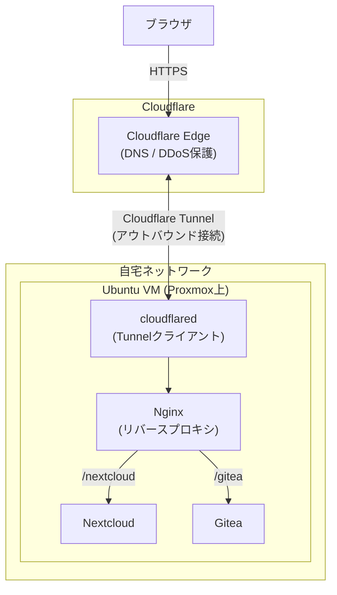

## はじめに

個人開発やインターンでアプリ開発の経験は積んできましたが、インフラ周りはずっと手薄でした。
クラウドを使えば済む話ではあるものの、「裏側で何が起きているか分からないまま使い続けている」のがずっと気になっていました。

もうひとつの悩みが、iPhoneのストレージ。写真・動画をよく撮るのでじわじわ圧迫されてきていて、クラウドストレージへの課金も考えましたが、せっかくなら自前で管理したいなと。

この2つをまとめて解決したくて、自宅サーバーを構築してみました。

## 全体構成

ミニPCを購入してProxmox VEをインストールし、その上にUbuntuのVM(仮想マシン)を作って各サービスを動かしています。

```
ミニPC
└── Proxmox VE
    └── Ubuntu VM
        ├── Nginx (リバースプロキシ)
        ├── [NextCloud]
        └── [Gitea]
```

## 前提環境

| 項目 | バージョン |
|---|---|
| Proxmox VE | v9.1-1 |
| Ubuntu | 24.04.3 LTS |

## ネットワーク構成

自宅のIPアドレスを直接公開したくないので、Cloudflare Tunnelを使って外部からアクセスできるようにしています。

<!-- TODO: 構成図を追加する -->

流れはこんな感じです:

1. ドメインを購入して、ネームサーバー(NS)をCloudflareに向ける
2. CloudflareでDNSレコードを管理
3. **Cloudflare Tunnel**（`cloudflared`）を自宅サーバー上で常駐させ、ポート開放やグローバルIP公開なしに外部からアクセスできるようにする
4. TunnelのバックエンドはNginxにして、各サービスへリバースプロキシ



TunnelのバックエンドはNginxにしていて、そこから各サービスへリバースプロキシしています。
CloudflareのTunnelで各サービスに直接つなぐこともできますが、インフラの学習目的もあるのと、将来VPNなど別のアクセス経路に変えたときに対応しやすいよう、あえてNginxを挟んでいます。

## 構築したサービス

今回立ち上げたのは以下の2つです。

| サービス | 用途 |
|---|---|
| Nextcloud | 写真・動画のバックアップ |
| Gitea | プライベートなGitリポジトリ管理 |

### Nextcloud

iCloudやGoogle Photosのセルフホスト代替となるサービスです。
iPhoneのストレージ問題を解決するのがメインの目的で、Nextcloudの公式iOSアプリを使うと撮影した写真・動画を自動でバックアップしてくれます。

クラウドストレージサービスと違って容量の上限はサーバーのディスク次第なので、ミニPCに大容量のストレージを積めば実質無制限にできます。

<!-- TODO: インストール・設定手順を追記する -->

### Gitea

GitHubのようなセルフホストのGitサービスです。
卒論や個人的なコードなど、外部サービスに置きたくないリポジトリを管理する目的で入れました。

GitHubのプライベートリポジトリでも事足りますが、自前で管理することでデータの置き場所を完全にコントロールできる点が気に入っています。
軽量でリソース消費も少ないので、ミニPCのスペックでも問題なく動いています。

<!-- TODO: インストール・設定手順を追記する -->

## まとめ

<!-- TODO: 完成後に記入する -->

- 自宅サーバー構築を通じて、仮想化・リバースプロキシ・DNS管理など普段ブラックボックスだった領域を実際に触ることができた
- Cloudflare Tunnelを使うことで、グローバルIPの公開やポート開放なしに外部アクセスを実現できる

## 参考

-
